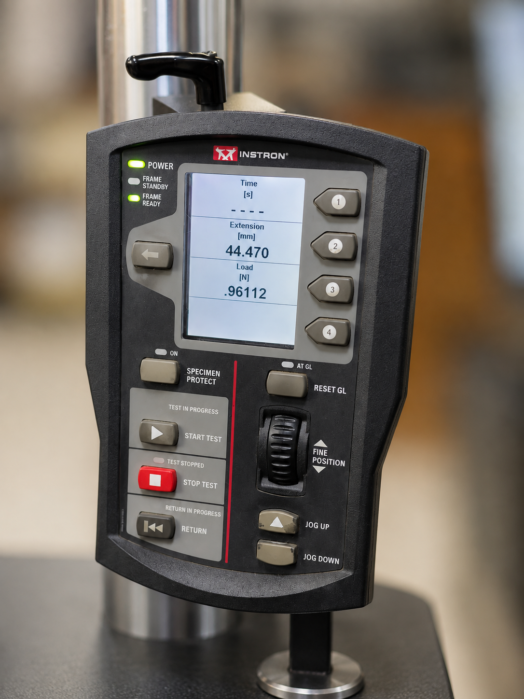
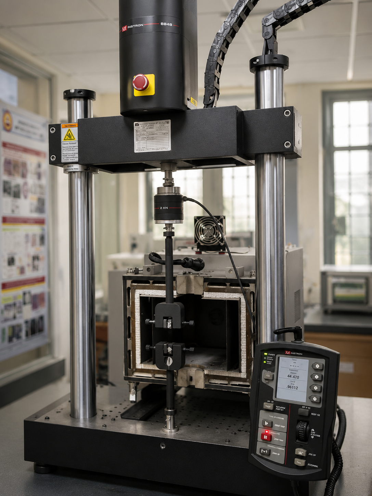
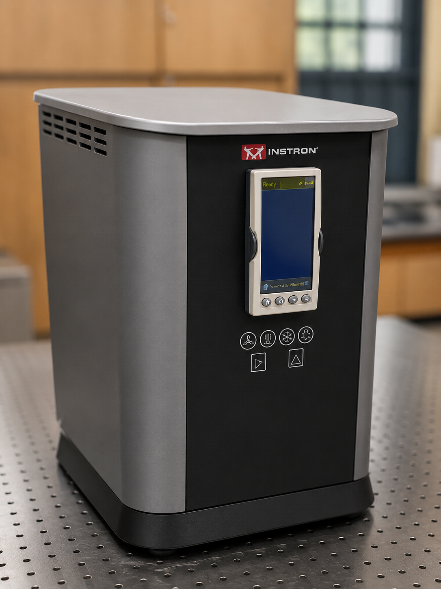
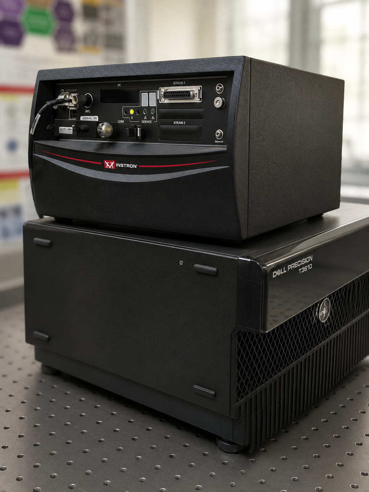
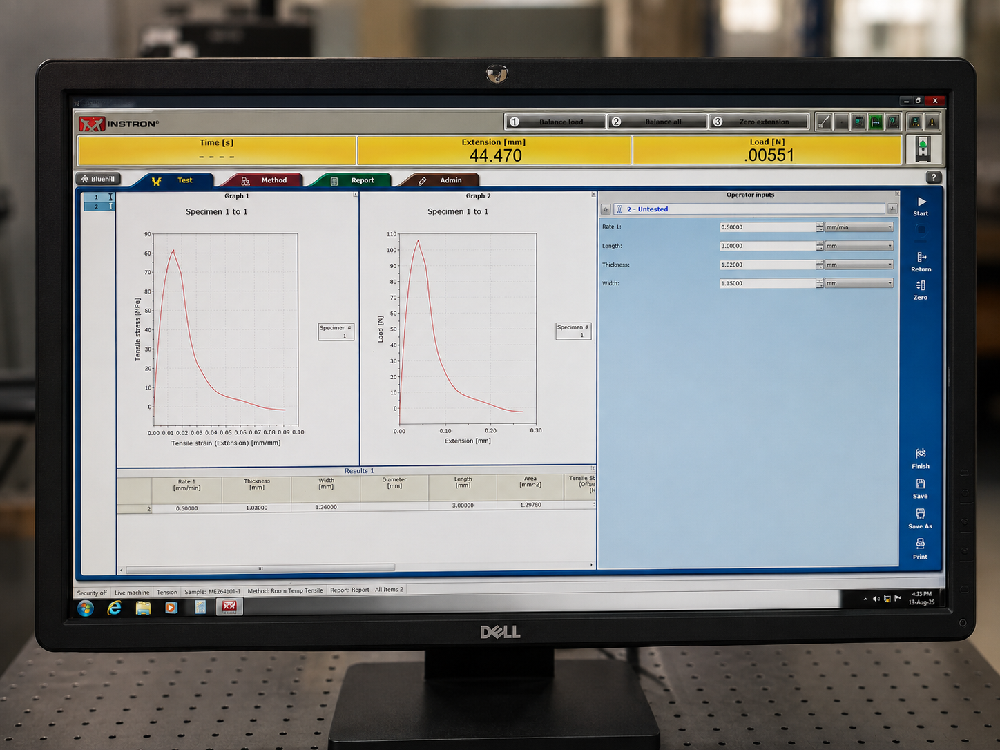

# Experiment 06 — Measurement of Mechanical Properties

### ME5381 — Basic Manufacturing Lab
### Department of Mechanical Engineering, IIT Madras

---

## 📌 Overview

This experiment was conducted to study the mechanical response of an
unknown specimen under tensile loading using a Micro Universal Testing
Machine (Micro-UTM).

The experiment combined theoretical understanding, hands-on machine
familiarization, experimental testing, and engineering data analysis.

### Experimental Workflow

**Theory → Micro-UTM Familiarization → Tensile Test → Raw CSV Data
→ Excel Processing → Mechanical Property Calculation → Graphical Analysis**

---

## 🎯 Objective

To perform a tensile test on an unknown specimen using a Micro-UTM and
evaluate important mechanical properties from the experimentally obtained
load-extension data.

---

## 📚 1. Background and Theory

Mechanical properties describe the response of a material to applied forces
and deformation.

Tensile testing can be used to evaluate properties such as:

- Yield Stress
- Ultimate Tensile Stress
- Fracture Stress
- Young's Modulus
- Resilience
- Toughness
- Ductility
- Strain-Hardening Exponent

### Engineering Stress

Engineering stress is calculated using the original cross-sectional area:

**σₑ = P / A₀**

where:

- **P** = Applied load
- **A₀** = Original cross-sectional area

### Engineering Strain

**e = Δl / l₀**

where:

- **Δl** = Change in gauge length
- **l₀** = Original gauge length

### True Stress

True stress is calculated using the instantaneous load and actual
cross-sectional area:

**σₜ = Pᵢ / Aᵢ**

### True Strain

True strain is obtained from the accumulated incremental deformation:

**ε = ln(1 + e)**

### Engineering–True Stress Relationship

**σₜ = σₑ(1 + e)**

These relationships were used during the experimental data processing.

---

## ⚙️ 2. Micro-UTM Familiarization

Before conducting the experiment, the theoretical concepts of stress,
strain and mechanical properties were introduced.

The laboratory technician then explained the Micro-UTM, including:

- Major machine components
- Functions of the components
- Working principle
- Specimen mounting
- Machine operation
- Test setup
- Data acquisition
- Tensile-testing procedure

This provided practical understanding of how the theoretical concepts
are applied during an actual materials-testing experiment.

---

## 🧪 3. Experimental Procedure

1. Reviewed the stress-strain theory and required calculations.
2. Studied the components and working principle of the Micro-UTM.
3. Learned the operating procedure from the laboratory technician.
4. Mounted an unknown specimen in the testing machine.
5. Performed the tensile test by progressively applying tensile load.
6. Recorded load and extension during the test.
7. Obtained the raw experimental data in CSV format.
8. Converted the raw CSV data into Excel.
9. Implemented formulas for engineering stress and strain.
10. Calculated true stress and true strain.
11. Evaluated the mechanical properties of the specimen.
12. Generated stress-strain and load-extension curves.
13. Performed strain-hardening analysis.

---

## 📊 4. Specimen and Experimental Data

The specimen dimensions used for the analysis were:

| Parameter | Value |
|---|---:|
| Gauge Length | 3.00 mm |
| Gauge Width | 1.15 mm |
| Gauge Thickness | 1.02 mm |
| Original Cross-sectional Area | 1.173 mm² |

The raw experimental data were initially provided in CSV format.

The data were then converted into Excel and processed using engineering
calculations and formulas.

The dataset contains **4,558 experimental data points**.

---

## 💻 5. Data Processing

The experimental data were processed in Excel to obtain:

- Engineering Stress
- Engineering Strain
- True Stress
- True Strain
- ln(True Stress)
- ln(True Strain)
- 0.2% Offset Yield Stress
- Mechanical Properties
- Strain-Hardening Parameters

The processing converted the raw machine output into quantities that could
be used for mechanical-property evaluation and graphical analysis.

---

## 📈 6. Results

The main calculated properties from the experimental data are:

| Mechanical Property | Result |
|---|---:|
| Ultimate Tensile Stress | **90.41 MPa** |
| 0.2% Yield Stress | **69.99 MPa** |
| Young's Modulus | **12.30 GPa** |
| Modulus of Resilience | **0.199 MJ/m³** |
| Modulus of Toughness | **2.054 MJ/m³** |
| Ductility | **7.17 %** |
| Strength Coefficient (K) | **597.47 MPa** |
| Strain-Hardening Exponent (n) | **0.436** |

> Note: Fracture stress was not included in the final Excel results
> summary, so no value has been assumed.

---

## 📉 7. Graphical Analysis

### 7.1 Load vs Extension

The load-extension curve shows the variation of applied load with
specimen extension during the tensile test.

### 7.2 Engineering Stress-Strain Curve

The engineering stress-strain curve was used for evaluating the
0.2% offset yield stress and ultimate tensile stress.

### 7.3 True Stress-Strain Curve

The true stress-strain curve represents the material response using
true stress and true strain.

### 7.4 Yield–Necking / Strain-Hardening Analysis

The plastic region was analyzed using logarithmic true stress and
true strain values.

The fitted relationship obtained was:

**y = 0.4355x + 6.3927**

with:

**R² = 0.9906**

The slope gives the strain-hardening exponent:

**n ≈ 0.436**

The corresponding strength coefficient is:

**K ≈ 597.47 MPa**

---

## 🖼️ 8. Experimental Setup

### Micro-UTM Control Panel



### Micro-UTM Tensile Testing Setup



### Micro-UTM Controller Unit



### Data Acquisition System



### Micro-UTM Display Unit



---

## 📂 9. Repository Contents

```text
06-mechanical-properties/
│
├── README.md
│
├── data/
│   └── Experimental_Data.xlsx
│
├── graphs/
│   └── Stress_Strain_Analysis.pdf
│
├── images/
│   ├── 01_micro_utm_control_panel.png
│   ├── 02_micro_utm_tensile_testing_setup.png
│   ├── 03_micro_utm_controller_unit.png
│   ├── 04_micro_utm_data_acquisition.png
│   └── 05_micro_utm_display_unit.png
│
└── report/
    └── Lab_Report.pdf
